# USM Autoimmune ML Platform - End-to-End Workflow

## Overview
This document describes the complete end-to-end workflow of the USM Autoimmune ML Platform, highlighting all Human-in-the-Loop (HITL) touchpoints where clinical expertise and researcher input are required.

## Workflow Diagram

```mermaid
graph TD
    Start([👤 Clinical Researcher<br/>Starts Platform]) --> Upload[📤 Data Upload<br/>Upload raw clinical CSV/Excel]
    
    Upload --> Quality{🔍 Data Quality Check<br/>Automated validation:<br/>- Missing values<br/>- Data types<br/>- Outliers}
    
    Quality -->|Issues Found| QualityReview[👥 HITL #1: Quality Review<br/>Researcher reviews:<br/>- Quality report dashboard<br/>- Decide: Clean or Reject<br/>- Set thresholds]
    QualityReview --> Quality
    
    Quality -->|Pass| Catalog[📚 Data Catalog<br/>Dataset registered<br/>Metadata stored]
    
    Catalog --> Labeling[🏷️ HITL #2: Data Labeling<br/>Domain Expert assigns:<br/>- Diagnosis labels SLE/MCTD/RA<br/>- Categorical mappings<br/>- Clinical annotations<br/>Uses: Labeling UI]
    
    Labeling --> Transform[🔄 Data Transformation<br/>Automated preprocessing:<br/>- Handle missing values<br/>- Encode categoricals<br/>- Normalize numerical]
    
    Transform --> FeatureEng[⚙️ Feature Engineering<br/>Generate derived features:<br/>- Interaction terms<br/>- Polynomial features<br/>- Domain-specific ratios]
    
    FeatureEng --> LASSO[🎯 HITL #3: LASSO Feature Selection<br/>Researcher controls:<br/>- Alpha parameter tuning<br/>- Review selected features<br/>- Accept/reject suggestions<br/>- Manual feature inclusion]
    
    LASSO --> DatasetGen[📊 Dataset Generation<br/>Automated split:<br/>- 80% Training set<br/>- 20% Test set<br/>- Stratified by diagnosis<br/>- Save to PostgreSQL + MinIO]
    
    DatasetGen --> BaseTraining[🤖 Base Model Training<br/>Train 13 algorithms in parallel:<br/>1. XGBoost<br/>2. LightGBM<br/>3. CatBoost<br/>4. Random Forest<br/>5. Gradient Boosting<br/>6. AdaBoost<br/>7. SVM<br/>8. MLP Neural Net<br/>9. KNN<br/>10. Decision Tree<br/>11. Logistic Regression<br/>12. Ridge Classifier<br/>13. Linear Discriminant<br/><br/>Each with Optuna HPO 30 trials]
    
    BaseTraining --> ModelEval[📈 Model Evaluation<br/>Calculate metrics:<br/>- OOF AUC-ROC<br/>- Test AUC-ROC<br/>- Precision/Recall/F1<br/>- Confusion Matrix]
    
    ModelEval --> Comparison[🔬 HITL #4: Model Comparison<br/>Researcher analyzes:<br/>- Side-by-side metrics<br/>- Performance tradeoffs<br/>- Select top models<br/>Uses: Comparison UI]
    
    Comparison --> EnsembleDecision{Include in<br/>Ensemble?}
    
    EnsembleDecision -->|Yes<br/>Select 3-5 models| Ensemble[🎭 Ensemble Training<br/>Meta-learner stacking:<br/>- Logistic Regression on OOF<br/>- Combines base predictions<br/>- Cross-validation<br/>- Final model training]
    
    EnsembleDecision -->|No<br/>Use single model| SingleModel[📦 Deploy Single Model]
    
    Ensemble --> FinalEval[✅ Final Model Evaluation<br/>Comprehensive metrics:<br/>- Holdout test performance<br/>- ROC curves<br/>- Calibration plots<br/>- SHAP explanations]
    
    SingleModel --> FinalEval
    
    FinalEval --> Scorecard[📋 HITL #5: Clinical Scorecard<br/>Clinician collaborates:<br/>- Review binning strategy<br/>- Adjust risk thresholds<br/>- Validate clinical relevance<br/>- Approve scoring system<br/>Uses: Scorecard Generator]
    
    Scorecard --> Deployment[🚀 Model Deployment<br/>Model ready for:<br/>- Real-time predictions<br/>- Batch inference<br/>- API integration<br/>- Clinical use]
    
    Deployment --> Inference[🔮 Inference & Monitoring<br/>Ongoing operations:<br/>- Patient predictions<br/>- Performance tracking<br/>- Model drift detection]
    
    Inference --> AuditLog[📝 Audit & Compliance<br/>All actions logged:<br/>- User actions<br/>- Timestamps<br/>- IP addresses<br/>- Model versions]
    
    AuditLog --> End([✨ Clinical Decision Support<br/>Active in Production])
    
    style Start fill:#e1f5e1
    style Labeling fill:#fff3cd,stroke:#ffc107,stroke-width:3px
    style QualityReview fill:#fff3cd,stroke:#ffc107,stroke-width:3px
    style LASSO fill:#fff3cd,stroke:#ffc107,stroke-width:3px
    style Comparison fill:#fff3cd,stroke:#ffc107,stroke-width:3px
    style Scorecard fill:#fff3cd,stroke:#ffc107,stroke-width:3px
    style BaseTraining fill:#d1ecf1,stroke:#0c5460,stroke-width:2px
    style Ensemble fill:#d1ecf1,stroke:#0c5460,stroke-width:2px
    style End fill:#d4edda
```

---

## 🟡 Human-in-the-Loop (HITL) Touchpoints

### HITL #1: Data Quality Review
**Role:** Clinical Researcher / Data Manager  
**Purpose:** Ensure data quality before processing  
**Actions:**
- Review automated quality report dashboard
- Analyze missing value patterns
- Detect outliers and anomalies
- Decide: Clean and proceed OR Reject and request new data
- Set acceptable thresholds (e.g., max 20% missing per column)

**Tools Used:** Data Quality Dashboard, Quality Metrics Page

---

### HITL #2: Data Labeling
**Role:** Domain Expert / Clinical Specialist  
**Purpose:** Assign accurate clinical labels and annotations  
**Actions:**
- Assign diagnosis labels (SLE, MCTD, RA) to patient records
- Map categorical variables (symptoms, demographics)
- Add clinical notes and annotations
- Validate label consistency across dataset
- Handle ambiguous cases requiring clinical judgment

**Tools Used:** Data Labeling Interface, Category Management UI

**Impact:** Critical for supervised learning - labels become ground truth

---

### HITL #3: LASSO Feature Selection
**Role:** Clinical Researcher / ML Engineer  
**Purpose:** Select clinically relevant features with statistical rigor  
**Actions:**
- Tune LASSO alpha parameter (regularization strength)
- Review automatically selected features
- Accept or reject feature suggestions based on:
  - Clinical domain knowledge
  - Statistical significance
  - Interpretability requirements
- Manually include must-have clinical features
- Exclude redundant or clinically irrelevant features

**Tools Used:** Feature Selection UI, LASSO Parameter Tuning Interface

**Output:** Curated feature set balancing performance and interpretability

---

### HITL #4: Model Comparison & Selection
**Role:** Clinical Researcher / ML Team  
**Purpose:** Select best-performing models for clinical deployment  
**Actions:**
- Compare 13 base models side-by-side
- Analyze performance metrics:
  - AUC-ROC (discrimination ability)
  - Precision (minimize false positives)
  - Recall (capture all positive cases)
  - F1-Score (balance)
- Consider model complexity vs. interpretability tradeoffs
- Select top 3-5 models for ensemble
- Decision: Use ensemble OR deploy single best model

**Tools Used:** Model Comparison Dashboard, Model Registry

**Clinical Considerations:**
- False positives vs. false negatives cost
- Interpretability for clinical acceptance
- Computational requirements for deployment

---

### HITL #5: Clinical Scorecard Generation
**Role:** Clinician / Medical Director  
**Purpose:** Translate ML model into clinically actionable scoring system  
**Actions:**
- Review feature binning strategy (e.g., age groups, lab ranges)
- Validate that bins align with clinical practice
- Adjust risk score thresholds:
  - Low risk: 0-40 points
  - Medium risk: 41-70 points
  - High risk: 71-100 points
- Approve risk stratification for clinical use
- Ensure scoring system is interpretable by clinicians

**Tools Used:** Clinical Scorecard Generator, Risk Stratification UI

**Output:** FDA-ready clinical decision support tool

---

## 🔵 Automated ML Components

### 13 Base Learners (Trained in Parallel)

Each algorithm undergoes:
- **Hyperparameter Optimization:** 30 trials with Optuna
- **Cross-Validation:** 5-fold stratified CV
- **Out-of-Fold (OOF) Predictions:** For stacking
- **Performance Metrics:** AUC, Precision, Recall, F1

**Algorithms:**
1. **XGBoost** - Gradient boosting, handles missing values
2. **LightGBM** - Fast gradient boosting, efficient for large datasets
3. **CatBoost** - Handles categorical features natively
4. **Random Forest** - Ensemble of decision trees
5. **Gradient Boosting** - Sequential tree boosting
6. **AdaBoost** - Adaptive boosting
7. **SVM** - Support Vector Machine with RBF kernel
8. **MLP** - Multi-layer Perceptron neural network
9. **KNN** - K-Nearest Neighbors
10. **Decision Tree** - Single interpretable tree
11. **Logistic Regression** - Linear classifier
12. **Ridge Classifier** - L2 regularized linear model
13. **Linear Discriminant Analysis** - Linear projection

### Ensemble Stacking Meta-Learner

**Architecture:**
- **Base Layer:** 13 diverse base learners
- **Meta-Learner:** Logistic Regression trained on OOF predictions
- **Combination:** Weighted averaging based on base model performance
- **Regularization:** Prevents overfitting to training data

**Benefits:**
- Combines strengths of multiple algorithms
- Reduces variance and improves generalization
- Often outperforms individual models

---

## 🔄 Automated Processing Stages

### 1. Data Transformation
- Impute missing values (median/mode)
- Encode categorical variables (one-hot/label encoding)
- Normalize numerical features (StandardScaler)
- Handle class imbalance (if needed)

### 2. Feature Engineering
- Generate interaction terms (e.g., age × disease_duration)
- Create polynomial features (e.g., lab_value²)
- Domain-specific ratios (e.g., neutrophil-to-lymphocyte ratio)
- Time-based features (e.g., months_since_diagnosis)

### 3. Dataset Generation
- Stratified train-test split (80/20)
- Preserve class distribution
- Store in PostgreSQL (metadata) + MinIO (artifacts)
- Version control for reproducibility

---

## 📊 Storage Architecture

### PostgreSQL (Metadata)
- Training job records
- Model metadata (hyperparameters, metrics)
- User activity audit logs
- Dataset registry

### MinIO (Artifacts)
- Trained model files (.pkl, .joblib)
- Feature importance files
- OOF prediction arrays
- Preprocessed datasets

---

## 🔐 Security & Compliance

### Audit Logging
Every action is logged:
- User ID and username
- Timestamp (UTC)
- Action type (upload, train, predict)
- Resource accessed (model ID, dataset ID)
- IP address
- Success/failure status

### Access Control
- Role-based permissions (Researcher, Clinician, Admin)
- JWT authentication
- Session management
- HTTPS/TLS 1.3 encryption

---

## 📈 Model Evaluation Metrics

### Discrimination Metrics
- **AUC-ROC:** Area under receiver operating characteristic curve
- **Precision:** True Positives / (True Positives + False Positives)
- **Recall (Sensitivity):** True Positives / (True Positives + False Negatives)
- **Specificity:** True Negatives / (True Negatives + False Positives)
- **F1-Score:** Harmonic mean of precision and recall

### Calibration Metrics
- **Brier Score:** Mean squared difference between predicted probabilities and actual outcomes
- **Calibration Plots:** Visual assessment of probability calibration

### Clinical Interpretability
- **SHAP Values:** Feature importance for individual predictions
- **Confusion Matrix:** Breakdown of correct and incorrect predictions
- **ROC Curves:** Tradeoff between sensitivity and specificity at different thresholds

---

## 🚀 Deployment Pipeline

### Pre-Deployment Checklist
- [ ] Model passes performance thresholds (e.g., AUC > 0.75)
- [ ] Clinical validation by medical team
- [ ] Scorecard approved for clinical use
- [ ] Security and compliance review passed
- [ ] User acceptance testing completed

### Deployment Options
1. **REST API:** Real-time predictions via HTTP endpoint
2. **Batch Processing:** Bulk predictions for multiple patients
3. **Clinical Integration:** FHIR/HL7 integration with EHR systems
4. **Edge Deployment:** On-device inference for privacy

### Monitoring in Production
- Track prediction latency
- Monitor model performance drift
- Alert on data distribution changes
- Log all predictions for audit trail
- A/B testing new model versions

---

## 🎯 Key Success Factors

1. **Clinical Expertise Integration:** 5 HITL touchpoints ensure domain knowledge is embedded
2. **Automated Scalability:** ML pipeline handles data processing and model training automatically
3. **Transparency:** Audit logs and SHAP explanations provide full traceability
4. **Performance:** 13 diverse algorithms + ensemble stacking maximize predictive accuracy
5. **Compliance:** FDA-aligned workflow with clinical validation and risk stratification

---

## 📞 Platform Components

### Frontend (React)
- Data Upload & Quality Dashboard
- Labeling Interface
- Feature Selection UI
- Model Comparison Dashboard
- Clinical Scorecard Generator

### Backend (FastAPI + Python)
- ML training orchestration
- Optuna hyperparameter optimization
- Scikit-learn, XGBoost, LightGBM, CatBoost
- SHAP explainability
- RESTful API endpoints

### Infrastructure
- PostgreSQL: Relational metadata storage
- MinIO: Object storage for large artifacts
- Docker: Containerized deployment
- Nginx: Reverse proxy + TLS termination

---

## 📚 References

- **Platform Type:** Enterprise ML Data Lakehouse
- **ML Framework:** Supervised Learning with Ensemble Methods
- **Domain:** Clinical Decision Support for Autoimmune Diseases
- **Regulatory Alignment:** FDA Software as a Medical Device (SaMD)
- **Data Standards:** FHIR-compatible patient records

---

**Document Version:** 1.0  
**Last Updated:** April 29, 2026  
**Author:** USM ML Platform Team
