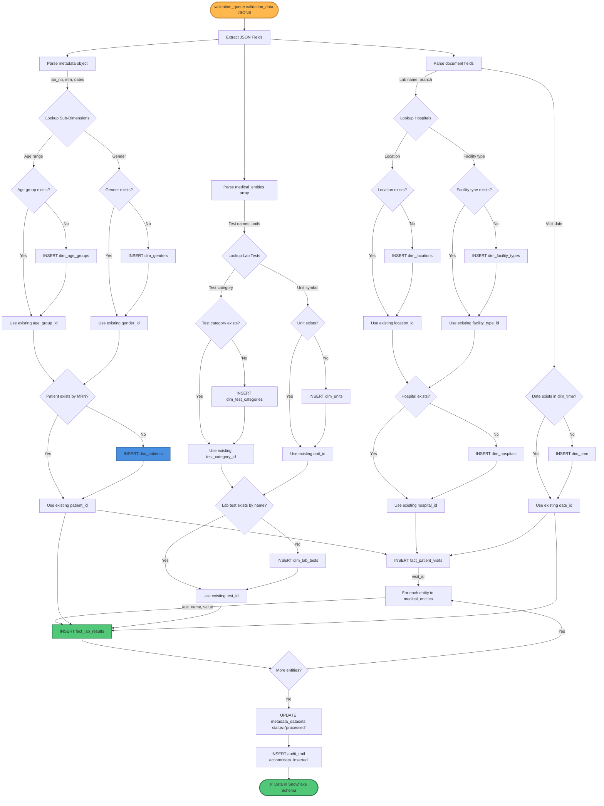

# PostgreSQL Snowflake Schema - Layer 4

---

## 🔷 SNOWFLAKE vs STAR Schema

**Snowflake Schema = Normalized Dimensions (Sub-Dimensions)**
- Dimensions split into hierarchical sub-tables
- Reduces redundancy, saves storage
- More complex joins, better for data integrity

**Star Schema = Denormalized Dimensions (Flat)**
- All dimension data in single table
- Faster queries, more redundant
- Simpler joins

**Our Implementation: SNOWFLAKE** (normalized sub-dimensions)

---

## 📊 Draw.io CSV Import Format

Copy the CSV below into draw.io:
**Arrange → Insert → Advanced → CSV**

```csv
# Snowflake Schema - USM Autoimmune ML Platform
# ================================================
# Format: entity, attribute, type, key, parent

# DIMENSION TABLES (Sub-Dimensions First - Snowflake Structure)
dim_age_groups, age_group_id, UUID, PK, 
dim_age_groups, age_range, VARCHAR, , 
dim_age_groups, min_age, INTEGER, , 
dim_age_groups, max_age, INTEGER, , 

dim_genders, gender_id, UUID, PK, 
dim_genders, gender_name, VARCHAR, , 
dim_genders, gender_code, CHAR(1), , 

dim_patients, patient_id, UUID, PK, 
dim_patients, anonymous_id, VARCHAR, , 
dim_patients, age_group_id, UUID, FK, dim_age_groups
dim_patients, gender_id, UUID, FK, dim_genders
dim_patients, date_of_birth, DATE, , 

dim_disease_categories, category_id, UUID, PK, 
dim_disease_categories, category_name, VARCHAR, , 
dim_disease_categories, category_code, VARCHAR, , 

dim_icd_codes, icd_id, UUID, PK, 
dim_icd_codes, icd_code, VARCHAR, , 
dim_icd_codes, icd_version, VARCHAR, , 

dim_diseases, disease_id, UUID, PK, 
dim_diseases, disease_name, VARCHAR, , 
dim_diseases, category_id, UUID, FK, dim_disease_categories
dim_diseases, icd_id, UUID, FK, dim_icd_codes
dim_diseases, description, TEXT, , 

dim_test_categories, test_category_id, UUID, PK, 
dim_test_categories, category_name, VARCHAR, , 

dim_units, unit_id, UUID, PK, 
dim_units, unit_name, VARCHAR, , 
dim_units, unit_symbol, VARCHAR, , 

dim_lab_tests, test_id, UUID, PK, 
dim_lab_tests, test_name, VARCHAR, , 
dim_lab_tests, test_code, VARCHAR, , 
dim_lab_tests, test_category_id, UUID, FK, dim_test_categories
dim_lab_tests, unit_id, UUID, FK, dim_units
dim_lab_tests, normal_range_min, FLOAT, , 
dim_lab_tests, normal_range_max, FLOAT, , 

dim_locations, location_id, UUID, PK, 
dim_locations, city, VARCHAR, , 
dim_locations, state, VARCHAR, , 
dim_locations, country, VARCHAR, , 

dim_facility_types, facility_type_id, UUID, PK, 
dim_facility_types, type_name, VARCHAR, , 

dim_hospitals, hospital_id, UUID, PK, 
dim_hospitals, hospital_name, VARCHAR, , 
dim_hospitals, branch, VARCHAR, , 
dim_hospitals, location_id, UUID, FK, dim_locations
dim_hospitals, facility_type_id, UUID, FK, dim_facility_types

dim_drug_classes, drug_class_id, UUID, PK, 
dim_drug_classes, class_name, VARCHAR, , 

dim_medications, medication_id, UUID, PK, 
dim_medications, medication_name, VARCHAR, , 
dim_medications, generic_name, VARCHAR, , 
dim_medications, drug_class_id, UUID, FK, dim_drug_classes
dim_medications, route, VARCHAR, , 

dim_time, date_id, DATE, PK, 
dim_time, year, INTEGER, , 
dim_time, month, INTEGER, , 
dim_time, day, INTEGER, , 
dim_time, quarter, INTEGER, , 
dim_time, day_of_week, VARCHAR, , 
dim_time, is_weekend, BOOLEAN, , 

# FACT TABLES (Center of Snowflake)
fact_patient_visits, visit_id, UUID, PK, 
fact_patient_visits, patient_id, UUID, FK, dim_patients
fact_patient_visits, hospital_id, UUID, FK, dim_hospitals
fact_patient_visits, visit_date, DATE, FK, dim_time
fact_patient_visits, visit_type, VARCHAR, , 
fact_patient_visits, clinical_notes, TEXT, , 

fact_lab_results, result_id, UUID, PK, 
fact_lab_results, patient_id, UUID, FK, dim_patients
fact_lab_results, test_id, UUID, FK, dim_lab_tests
fact_lab_results, visit_id, UUID, FK, fact_patient_visits
fact_lab_results, result_date, DATE, FK, dim_time
fact_lab_results, result_value, FLOAT, , 
fact_lab_results, is_abnormal, BOOLEAN, , 
fact_lab_results, flag, VARCHAR, , 

fact_diagnoses, diagnosis_id, UUID, PK, 
fact_diagnoses, patient_id, UUID, FK, dim_patients
fact_diagnoses, disease_id, UUID, FK, dim_diseases
fact_diagnoses, visit_id, UUID, FK, fact_patient_visits
fact_diagnoses, diagnosis_date, DATE, FK, dim_time
fact_diagnoses, severity, VARCHAR, , 
fact_diagnoses, status, VARCHAR, , 

fact_prescriptions, prescription_id, UUID, PK, 
fact_prescriptions, patient_id, UUID, FK, dim_patients
fact_prescriptions, medication_id, UUID, FK, dim_medications
fact_prescriptions, visit_id, UUID, FK, fact_patient_visits
fact_prescriptions, prescribed_date, DATE, FK, dim_time
fact_prescriptions, dosage, VARCHAR, , 
fact_prescriptions, frequency, VARCHAR, , 

fact_disease_specific_data, record_id, UUID, PK, 
fact_disease_specific_data, patient_id, UUID, FK, dim_patients
fact_disease_specific_data, disease_id, UUID, FK, dim_diseases
fact_disease_specific_data, visit_id, UUID, FK, fact_patient_visits
fact_disease_specific_data, assessment_date, DATE, FK, dim_time
fact_disease_specific_data, data, JSONB, , 

# METADATA TABLES (Governance)
metadata_datasets, dataset_id, UUID, PK, 
metadata_datasets, filename, VARCHAR, , 
metadata_datasets, file_type, VARCHAR, , 
metadata_datasets, file_hash, VARCHAR, , 
metadata_datasets, storage_path, TEXT, , 
metadata_datasets, status, VARCHAR, , 

validation_queue, validation_id, UUID, PK, 
validation_queue, dataset_id, UUID, FK, metadata_datasets
validation_queue, stage, VARCHAR, , 
validation_queue, status, VARCHAR, , 
validation_queue, validation_data, JSONB, , 
validation_queue, reviewed_by, INTEGER, , 

audit_trail, trail_id, UUID, PK, 
audit_trail, dataset_id, UUID, FK, metadata_datasets
audit_trail, action, VARCHAR, , 
audit_trail, performed_by, INTEGER, , 
audit_trail, timestamp, TIMESTAMP, , 
audit_trail, details, JSONB, , 
```

---

## 📋 SQL CREATE TABLE Statements

```sql
-- ============================================
-- SNOWFLAKE SCHEMA: SUB-DIMENSIONS FIRST
-- ============================================

-- Sub-Dimension: Age Groups
CREATE TABLE dim_age_groups (
    age_group_id UUID PRIMARY KEY DEFAULT gen_random_uuid(),
    age_range VARCHAR(20) NOT NULL,  -- "30-40", "40-50", etc.
    min_age INTEGER NOT NULL,
    max_age INTEGER NOT NULL,
    created_at TIMESTAMP DEFAULT NOW()
);

-- Sub-Dimension: Genders
CREATE TABLE dim_genders (
    gender_id UUID PRIMARY KEY DEFAULT gen_random_uuid(),
    gender_name VARCHAR(50) NOT NULL,  -- "Male", "Female", "Other"
    gender_code CHAR(1) NOT NULL,  -- "M", "F", "O"
    created_at TIMESTAMP DEFAULT NOW()
);

-- Main Dimension: Patients (references sub-dimensions)
CREATE TABLE dim_patients (
    patient_id UUID PRIMARY KEY DEFAULT gen_random_uuid(),
    anonymous_id VARCHAR(100) NOT NULL UNIQUE,
    age_group_id UUID REFERENCES dim_age_groups(age_group_id),
    gender_id UUID REFERENCES dim_genders(gender_id),
    date_of_birth DATE,
    created_at TIMESTAMP DEFAULT NOW(),
    updated_at TIMESTAMP DEFAULT NOW()
);

-- Sub-Dimension: Disease Categories
CREATE TABLE dim_disease_categories (
    category_id UUID PRIMARY KEY DEFAULT gen_random_uuid(),
    category_name VARCHAR(100) NOT NULL,  -- "Autoimmune", "Inflammatory", etc.
    category_code VARCHAR(20),
    created_at TIMESTAMP DEFAULT NOW()
);

-- Sub-Dimension: ICD Codes
CREATE TABLE dim_icd_codes (
    icd_id UUID PRIMARY KEY DEFAULT gen_random_uuid(),
    icd_code VARCHAR(20) NOT NULL UNIQUE,  -- "M32.9", "M35.0"
    icd_version VARCHAR(20),  -- "ICD-10", "ICD-11"
    created_at TIMESTAMP DEFAULT NOW()
);

-- Main Dimension: Diseases (references sub-dimensions)
CREATE TABLE dim_diseases (
    disease_id UUID PRIMARY KEY DEFAULT gen_random_uuid(),
    disease_name VARCHAR(200) NOT NULL,
    category_id UUID REFERENCES dim_disease_categories(category_id),
    icd_id UUID REFERENCES dim_icd_codes(icd_id),
    description TEXT,
    created_at TIMESTAMP DEFAULT NOW()
);

-- Sub-Dimension: Test Categories
CREATE TABLE dim_test_categories (
    test_category_id UUID PRIMARY KEY DEFAULT gen_random_uuid(),
    category_name VARCHAR(100) NOT NULL,  -- "Hematology", "Biochemistry", etc.
    created_at TIMESTAMP DEFAULT NOW()
);

-- Sub-Dimension: Units
CREATE TABLE dim_units (
    unit_id UUID PRIMARY KEY DEFAULT gen_random_uuid(),
    unit_name VARCHAR(100) NOT NULL,  -- "grams per liter"
    unit_symbol VARCHAR(20) NOT NULL UNIQUE,  -- "g/L"
    created_at TIMESTAMP DEFAULT NOW()
);

-- Main Dimension: Lab Tests (references sub-dimensions)
CREATE TABLE dim_lab_tests (
    test_id UUID PRIMARY KEY DEFAULT gen_random_uuid(),
    test_name VARCHAR(200) NOT NULL,
    test_code VARCHAR(50),
    test_category_id UUID REFERENCES dim_test_categories(test_category_id),
    unit_id UUID REFERENCES dim_units(unit_id),
    normal_range_min FLOAT,
    normal_range_max FLOAT,
    created_at TIMESTAMP DEFAULT NOW()
);

-- Sub-Dimension: Locations
CREATE TABLE dim_locations (
    location_id UUID PRIMARY KEY DEFAULT gen_random_uuid(),
    city VARCHAR(100),
    state VARCHAR(100),
    country VARCHAR(100) DEFAULT 'Malaysia',
    created_at TIMESTAMP DEFAULT NOW()
);

-- Sub-Dimension: Facility Types
CREATE TABLE dim_facility_types (
    facility_type_id UUID PRIMARY KEY DEFAULT gen_random_uuid(),
    type_name VARCHAR(100) NOT NULL,  -- "Hospital", "Clinic", "Lab"
    created_at TIMESTAMP DEFAULT NOW()
);

-- Main Dimension: Hospitals (references sub-dimensions)
CREATE TABLE dim_hospitals (
    hospital_id UUID PRIMARY KEY DEFAULT gen_random_uuid(),
    hospital_name VARCHAR(200) NOT NULL,
    branch VARCHAR(100),
    location_id UUID REFERENCES dim_locations(location_id),
    facility_type_id UUID REFERENCES dim_facility_types(facility_type_id),
    created_at TIMESTAMP DEFAULT NOW()
);

-- Sub-Dimension: Drug Classes
CREATE TABLE dim_drug_classes (
    drug_class_id UUID PRIMARY KEY DEFAULT gen_random_uuid(),
    class_name VARCHAR(100) NOT NULL,  -- "Immunosuppressant", "Antimalarial"
    created_at TIMESTAMP DEFAULT NOW()
);

-- Main Dimension: Medications (references sub-dimensions)
CREATE TABLE dim_medications (
    medication_id UUID PRIMARY KEY DEFAULT gen_random_uuid(),
    medication_name VARCHAR(200) NOT NULL,
    generic_name VARCHAR(200),
    drug_class_id UUID REFERENCES dim_drug_classes(drug_class_id),
    route VARCHAR(50),  -- "Oral", "IV", "IM"
    created_at TIMESTAMP DEFAULT NOW()
);

-- Dimension: Time (no sub-dimensions - atomic)
CREATE TABLE dim_time (
    date_id DATE PRIMARY KEY,
    year INTEGER NOT NULL,
    month INTEGER NOT NULL,
    day INTEGER NOT NULL,
    quarter INTEGER NOT NULL,
    day_of_week VARCHAR(20) NOT NULL,
    is_weekend BOOLEAN NOT NULL
);

-- ============================================
-- FACT TABLES (Center of Snowflake)
-- ============================================

CREATE TABLE fact_patient_visits (
    visit_id UUID PRIMARY KEY DEFAULT gen_random_uuid(),
    patient_id UUID NOT NULL REFERENCES dim_patients(patient_id),
    hospital_id UUID NOT NULL REFERENCES dim_hospitals(hospital_id),
    visit_date DATE NOT NULL REFERENCES dim_time(date_id),
    visit_type VARCHAR(50),
    clinical_notes TEXT,
    created_at TIMESTAMP DEFAULT NOW()
);

CREATE TABLE fact_lab_results (
    result_id UUID PRIMARY KEY DEFAULT gen_random_uuid(),
    patient_id UUID NOT NULL REFERENCES dim_patients(patient_id),
    test_id UUID NOT NULL REFERENCES dim_lab_tests(test_id),
    visit_id UUID REFERENCES fact_patient_visits(visit_id),
    result_date DATE NOT NULL REFERENCES dim_time(date_id),
    result_value FLOAT NOT NULL,
    is_abnormal BOOLEAN DEFAULT FALSE,
    flag VARCHAR(10),
    created_at TIMESTAMP DEFAULT NOW()
);

CREATE TABLE fact_diagnoses (
    diagnosis_id UUID PRIMARY KEY DEFAULT gen_random_uuid(),
    patient_id UUID NOT NULL REFERENCES dim_patients(patient_id),
    disease_id UUID NOT NULL REFERENCES dim_diseases(disease_id),
    visit_id UUID REFERENCES fact_patient_visits(visit_id),
    diagnosis_date DATE NOT NULL REFERENCES dim_time(date_id),
    severity VARCHAR(50),
    status VARCHAR(50),
    notes TEXT,
    created_at TIMESTAMP DEFAULT NOW()
);

CREATE TABLE fact_prescriptions (
    prescription_id UUID PRIMARY KEY DEFAULT gen_random_uuid(),
    patient_id UUID NOT NULL REFERENCES dim_patients(patient_id),
    medication_id UUID NOT NULL REFERENCES dim_medications(medication_id),
    visit_id UUID REFERENCES fact_patient_visits(visit_id),
    prescribed_date DATE NOT NULL REFERENCES dim_time(date_id),
    dosage VARCHAR(100),
    frequency VARCHAR(100),
    duration_days INTEGER,
    instructions TEXT,
    created_at TIMESTAMP DEFAULT NOW()
);

CREATE TABLE fact_disease_specific_data (
    record_id UUID PRIMARY KEY DEFAULT gen_random_uuid(),
    patient_id UUID NOT NULL REFERENCES dim_patients(patient_id),
    disease_id UUID NOT NULL REFERENCES dim_diseases(disease_id),
    visit_id UUID REFERENCES fact_patient_visits(visit_id),
    assessment_date DATE NOT NULL REFERENCES dim_time(date_id),
    data JSONB NOT NULL,  -- Flexible storage for ANY disease metrics
    created_at TIMESTAMP DEFAULT NOW()
);

-- ============================================
-- METADATA TABLES (Governance)
-- ============================================

CREATE TABLE metadata_datasets (
    dataset_id UUID PRIMARY KEY DEFAULT gen_random_uuid(),
    filename VARCHAR(500) NOT NULL,
    file_type VARCHAR(20) NOT NULL,
    file_hash VARCHAR(100) NOT NULL UNIQUE,
    storage_path TEXT,
    uploaded_by INTEGER,
    upload_date TIMESTAMP DEFAULT NOW(),
    status VARCHAR(50) NOT NULL,
    processed_date TIMESTAMP,
    created_at TIMESTAMP DEFAULT NOW()
);

CREATE TABLE validation_queue (
    validation_id UUID PRIMARY KEY DEFAULT gen_random_uuid(),
    dataset_id UUID NOT NULL REFERENCES metadata_datasets(dataset_id),
    stage VARCHAR(50) NOT NULL,
    status VARCHAR(50) NOT NULL,
    validation_data JSONB,
    reviewed_by INTEGER,
    reviewed_at TIMESTAMP,
    rejection_reason TEXT,
    created_at TIMESTAMP DEFAULT NOW()
);

CREATE TABLE audit_trail (
    trail_id UUID PRIMARY KEY DEFAULT gen_random_uuid(),
    dataset_id UUID REFERENCES metadata_datasets(dataset_id),
    action VARCHAR(100) NOT NULL,
    performed_by INTEGER,
    timestamp TIMESTAMP DEFAULT NOW(),
    details JSONB
);

-- ============================================
-- INDEXES (Performance Optimization)
-- ============================================

-- Dimension indexes
CREATE INDEX idx_patients_age_group ON dim_patients(age_group_id);
CREATE INDEX idx_patients_gender ON dim_patients(gender_id);
CREATE INDEX idx_diseases_category ON dim_diseases(category_id);
CREATE INDEX idx_diseases_icd ON dim_diseases(icd_id);
CREATE INDEX idx_lab_tests_category ON dim_lab_tests(test_category_id);
CREATE INDEX idx_lab_tests_unit ON dim_lab_tests(unit_id);
CREATE INDEX idx_hospitals_location ON dim_hospitals(location_id);
CREATE INDEX idx_hospitals_type ON dim_hospitals(facility_type_id);
CREATE INDEX idx_medications_class ON dim_medications(drug_class_id);

-- Fact table indexes
CREATE INDEX idx_lab_results_patient ON fact_lab_results(patient_id);
CREATE INDEX idx_lab_results_test ON fact_lab_results(test_id);
CREATE INDEX idx_lab_results_date ON fact_lab_results(result_date);
CREATE INDEX idx_lab_results_visit ON fact_lab_results(visit_id);

CREATE INDEX idx_diagnoses_patient ON fact_diagnoses(patient_id);
CREATE INDEX idx_diagnoses_disease ON fact_diagnoses(disease_id);
CREATE INDEX idx_diagnoses_date ON fact_diagnoses(diagnosis_date);

CREATE INDEX idx_prescriptions_patient ON fact_prescriptions(patient_id);
CREATE INDEX idx_prescriptions_med ON fact_prescriptions(medication_id);
CREATE INDEX idx_prescriptions_date ON fact_prescriptions(prescribed_date);

-- Metadata indexes
CREATE INDEX idx_validation_dataset ON validation_queue(dataset_id);
CREATE INDEX idx_validation_status ON validation_queue(status);
CREATE INDEX idx_audit_dataset ON audit_trail(dataset_id);
CREATE INDEX idx_audit_timestamp ON audit_trail(timestamp);
```

---

## 🔷 Text-Based Snowflake Schema Diagram

```
SNOWFLAKE SCHEMA STRUCTURE (Normalized Dimensions with Sub-Dimensions)
========================================================================

                    ┌─────────────────┐
                    │  dim_time       │
                    │  ─────────────  │
                    │  date_id PK     │
                    │  year           │
                    │  month          │
                    │  quarter        │
                    └────────┬────────┘
                             │
        ┌────────────────────┼────────────────────┐
        │                    │                    │
        │                    │                    │
        │                    │                    │
┌───────▼───────┐    ┌──────▼──────┐    ┌───────▼────────┐
│ dim_age_groups│    │ dim_genders │    │dim_disease_cat │
│ ──────────────│    │─────────────│    │ ───────────────│
│ age_group_id  │    │ gender_id   │    │ category_id PK │
│ age_range     │    │ gender_name │    │ category_name  │
└───────┬───────┘    └──────┬──────┘    └───────┬────────┘
        │                   │                    │
        │         ┌─────────▼────────┐           │
        │         │  dim_patients    │           │
        └────────►│  ───────────────│           │
                  │  patient_id PK   │           │
                  │  anonymous_id    │           │
                  │  age_group_id FK │           │
                  │  gender_id FK    │           │
                  └─────────┬────────┘           │
                            │                    │
            ┌───────────────┼────────────────────┼───────────────┐
            │               │                    │               │
            │               │            ┌───────▼───────┐       │
            │               │            │ dim_icd_codes │       │
            │               │            │ ──────────────│       │
            │               │            │ icd_id PK     │       │
            │               │            │ icd_code      │       │
            │               │            └───────┬───────┘       │
            │               │                    │               │
            │               │          ┌─────────▼────────┐      │
            │               │          │  dim_diseases    │      │
            │               │          │  ───────────────│      │
            │               │          │  disease_id PK   │      │
            │               │          │  category_id FK ─┼──────┘
            │               │          │  icd_id FK       │
            │               │          └─────────┬────────┘
            │               │                    │
    ┌───────▼──────┐┌──────▼────────┐  ┌───────▼───────┐
    │ dim_test_cat ││ dim_units     │  │ dim_locations │
    │ ─────────────││ ─────────────│  │ ──────────────│
    │ test_cat_id  ││ unit_id PK    │  │ location_id PK│
    └───────┬──────┘└──────┬────────┘  └───────┬───────┘
            │              │                    │
       ┌────▼─────────┐    │         ┌─────────▼────────┐
       │dim_lab_tests │    │         │dim_facility_types│
       │──────────────│    │         │ ─────────────────│
       │ test_id PK   │    │         │ facility_type_id │
       │ test_cat_id ─┼────┘         └─────────┬────────┘
       │ unit_id FK   │                        │
       └───────┬──────┘              ┌─────────▼────────┐
               │                     │  dim_hospitals   │
               │                     │  ───────────────│
               │                     │  hospital_id PK  │
               │                     │  location_id FK ─┼────┘
               │                     │  facility_type_i │
               │                     └─────────┬────────┘
               │                               │
       ┌───────▼──────┐                        │
       │dim_drug_class│                        │
       │──────────────│                        │
       │ drug_class_id│                        │
       └───────┬──────┘                        │
               │                                │
       ┌───────▼────────┐                      │
       │ dim_medications│                      │
       │ ───────────────│                      │
       │ medication_id  │                      │
       │ drug_class_id ─┼──────┘              │
       └───────┬────────┘                      │
               │                                │
               │                                │
    ═══════════╧════════════════════════════════╧═══════════
                     FACT TABLES (CENTER)
    ═══════════╤════════════════════════════════╤═══════════
               │                                │
      ┌────────▼────────────┐          ┌───────▼───────────┐
      │fact_patient_visits  │          │ fact_lab_results  │
      │ ─────────────────── │          │ ─────────────────│
      │ visit_id PK         │          │ result_id PK      │
      │ patient_id FK       │          │ patient_id FK     │
      │ hospital_id FK      │          │ test_id FK        │
      │ visit_date FK       │          │ visit_id FK ──────┼──┐
      └────────┬────────────┘          │ result_date FK    │  │
               │                       └───────────────────┘  │
               │                                              │
      ┌────────▼────────────┐          ┌───────────────────┐  │
      │ fact_diagnoses      │          │fact_prescriptions │  │
      │ ─────────────────── │          │ ─────────────────│  │
      │ diagnosis_id PK     │          │prescription_id PK │  │
      │ patient_id FK       │          │ patient_id FK     │  │
      │ disease_id FK       │          │ medication_id FK  │  │
      │ visit_id FK ────────┼──────────┼─visit_id FK ──────┼──┤
      │ diagnosis_date FK   │          │prescribed_date FK │  │
      └─────────────────────┘          └───────────────────┘  │
                                                                │
              ┌───────────────────────────────────────────────┘
              │
      ┌───────▼─────────────────────┐
      │fact_disease_specific_data   │
      │──────────────────────────── │
      │ record_id PK                │
      │ patient_id FK               │
      │ disease_id FK               │
      │ visit_id FK                 │
      │ assessment_date FK          │
      │ data JSONB                  │
      └─────────────────────────────┘


METADATA TABLES (Governance Layer)
═══════════════════════════════════

┌───────────────────┐     ┌──────────────────┐     ┌──────────────┐
│metadata_datasets  │────►│validation_queue  │     │ audit_trail  │
│ ─────────────────│     │ ────────────────│     │ ────────────│
│ dataset_id PK     │     │ validation_id PK │     │ trail_id PK  │
│ filename          │     │ dataset_id FK    │     │ dataset_id FK│
│ file_hash         │     │ validation_data  │     │ action       │
│ status            │     │ status           │     │ timestamp    │
└───────────────────┘     └──────────────────┘     └──────────────┘
```

---

## 📊 Data Flow: validation_queue → Snowflake Schema



---

## Entity Relationship Diagram

```mermaid
erDiagram
    %% ============================================
    %% DIMENSION TABLES (Master Data)
    %% ============================================
    
    dim_patients {
        UUID patient_id PK
        VARCHAR anonymous_id
        VARCHAR age_range
        VARCHAR gender
        DATE date_of_birth
        TIMESTAMP created_at
        TIMESTAMP updated_at
    }
    
    dim_diseases {
        UUID disease_id PK
        VARCHAR disease_name
        VARCHAR icd_code
        VARCHAR category
        TEXT description
        TIMESTAMP created_at
    }
    
    dim_lab_tests {
        UUID test_id PK
        VARCHAR test_name
        VARCHAR test_code
        VARCHAR unit
        FLOAT normal_range_min
        FLOAT normal_range_max
        VARCHAR category
        TIMESTAMP created_at
    }
    
    dim_hospitals {
        UUID hospital_id PK
        VARCHAR hospital_name
        VARCHAR branch
        VARCHAR location
        VARCHAR facility_type
        TIMESTAMP created_at
    }
    
    dim_medications {
        UUID medication_id PK
        VARCHAR medication_name
        VARCHAR generic_name
        VARCHAR drug_class
        VARCHAR route
        TIMESTAMP created_at
    }
    
    dim_time {
        DATE date_id PK
        INTEGER year
        INTEGER month
        INTEGER day
        INTEGER quarter
        VARCHAR day_of_week
        BOOLEAN is_weekend
    }
    
    %% ============================================
    %% FACT TABLES (Measurements & Events)
    %% ============================================
    
    fact_patient_visits {
        UUID visit_id PK
        UUID patient_id FK
        UUID hospital_id FK
        DATE visit_date FK
        VARCHAR visit_type
        TEXT clinical_notes
        TIMESTAMP created_at
    }
    
    fact_lab_results {
        UUID result_id PK
        UUID patient_id FK
        UUID test_id FK
        UUID visit_id FK
        DATE result_date FK
        FLOAT result_value
        VARCHAR unit
        FLOAT ref_range_low
        FLOAT ref_range_high
        BOOLEAN is_abnormal
        VARCHAR flag
        TIMESTAMP created_at
    }
    
    fact_diagnoses {
        UUID diagnosis_id PK
        UUID patient_id FK
        UUID disease_id FK
        UUID visit_id FK
        DATE diagnosis_date FK
        VARCHAR severity
        VARCHAR status
        TEXT notes
        TIMESTAMP created_at
    }
    
    fact_prescriptions {
        UUID prescription_id PK
        UUID patient_id FK
        UUID medication_id FK
        UUID visit_id FK
        DATE prescribed_date FK
        VARCHAR dosage
        VARCHAR frequency
        INTEGER duration_days
        TEXT instructions
        TIMESTAMP created_at
    }
    
    fact_disease_specific_data {
        UUID record_id PK
        UUID patient_id FK
        UUID disease_id FK
        UUID visit_id FK
        DATE assessment_date FK
        JSONB data
        TIMESTAMP created_at
    }
    
    %% ============================================
    %% METADATA TABLES (Governance & Tracking)
    %% ============================================
    
    metadata_datasets {
        UUID dataset_id PK
        VARCHAR filename
        VARCHAR file_type
        VARCHAR file_hash
        TEXT storage_path
        INTEGER uploaded_by
        TIMESTAMP upload_date
        VARCHAR status
        TIMESTAMP processed_date
        TIMESTAMP created_at
    }
    
    validation_queue {
        UUID validation_id PK
        UUID dataset_id FK
        VARCHAR stage
        VARCHAR status
        JSONB validation_data
        INTEGER reviewed_by
        TIMESTAMP reviewed_at
        TEXT rejection_reason
        TIMESTAMP created_at
    }
    
    audit_trail {
        UUID trail_id PK
        UUID dataset_id FK
        VARCHAR action
        INTEGER performed_by
        TIMESTAMP timestamp
        JSONB details
    }
    
    %% ============================================
    %% RELATIONSHIPS
    %% ============================================
    
    %% Dimension to Fact relationships
    dim_patients ||--o{ fact_patient_visits : "has visits"
    dim_patients ||--o{ fact_lab_results : "has lab results"
    dim_patients ||--o{ fact_diagnoses : "has diagnoses"
    dim_patients ||--o{ fact_prescriptions : "receives prescriptions"
    dim_patients ||--o{ fact_disease_specific_data : "has disease data"
    
    dim_hospitals ||--o{ fact_patient_visits : "hosts visits"
    
    dim_lab_tests ||--o{ fact_lab_results : "measured in"
    
    dim_diseases ||--o{ fact_diagnoses : "diagnosed with"
    dim_diseases ||--o{ fact_disease_specific_data : "tracks"
    
    dim_medications ||--o{ fact_prescriptions : "prescribed as"
    
    dim_time ||--o{ fact_patient_visits : "visit date"
    dim_time ||--o{ fact_lab_results : "result date"
    dim_time ||--o{ fact_diagnoses : "diagnosis date"
    dim_time ||--o{ fact_prescriptions : "prescribed date"
    dim_time ||--o{ fact_disease_specific_data : "assessment date"
    
    %% Fact to Fact relationships
    fact_patient_visits ||--o{ fact_lab_results : "visit contains"
    fact_patient_visits ||--o{ fact_diagnoses : "visit contains"
    fact_patient_visits ||--o{ fact_prescriptions : "visit contains"
    fact_patient_visits ||--o{ fact_disease_specific_data : "visit contains"
    
    %% Metadata relationships
    metadata_datasets ||--o{ validation_queue : "queued for validation"
    metadata_datasets ||--o{ audit_trail : "tracked in"
```



---

## Snowflake Schema Architecture

```mermaid
graph TD
    %% Style definitions
    classDef dimTable fill:#4A90E2,stroke:#2E5C8A,stroke-width:3px,color:#fff
    classDef factTable fill:#50C878,stroke:#2E7D4E,stroke-width:3px,color:#fff
    classDef metaTable fill:#FFB84D,stroke:#CC8A3D,stroke-width:3px,color:#000
    
    %% Dimension Tables (Blue)
    DimPatients[dim_patients<br/>patient_id PK<br/>anonymous_id<br/>age_range<br/>gender]:::dimTable
    DimDiseases[dim_diseases<br/>disease_id PK<br/>disease_name<br/>icd_code]:::dimTable
    DimLabTests[dim_lab_tests<br/>test_id PK<br/>test_name<br/>unit<br/>normal_range]:::dimTable
    DimHospitals[dim_hospitals<br/>hospital_id PK<br/>hospital_name<br/>branch]:::dimTable
    DimMeds[dim_medications<br/>medication_id PK<br/>medication_name<br/>drug_class]:::dimTable
    DimTime[dim_time<br/>date_id PK<br/>year<br/>month<br/>quarter]:::dimTable
    
    %% Fact Tables (Green)
    FactVisits[fact_patient_visits<br/>visit_id PK<br/>patient_id FK<br/>hospital_id FK<br/>visit_date FK]:::factTable
    FactLabResults[fact_lab_results<br/>result_id PK<br/>patient_id FK<br/>test_id FK<br/>result_value<br/>is_abnormal]:::factTable
    FactDiagnoses[fact_diagnoses<br/>diagnosis_id PK<br/>patient_id FK<br/>disease_id FK<br/>severity]:::factTable
    FactPrescriptions[fact_prescriptions<br/>prescription_id PK<br/>patient_id FK<br/>medication_id FK<br/>dosage]:::factTable
    FactDiseaseData[fact_disease_specific_data<br/>record_id PK<br/>patient_id FK<br/>disease_id FK<br/>data JSONB]:::factTable
    
    %% Metadata Tables (Orange)
    MetaDatasets[metadata_datasets<br/>dataset_id PK<br/>filename<br/>file_hash<br/>status]:::metaTable
    ValidationQueue[validation_queue<br/>validation_id PK<br/>dataset_id FK<br/>validation_data JSONB<br/>status]:::metaTable
    AuditTrail[audit_trail<br/>trail_id PK<br/>dataset_id FK<br/>action<br/>performed_by]:::metaTable
    
    %% Relationships: Dimensions to Facts
    DimPatients -->|patient_id| FactVisits
    DimPatients -->|patient_id| FactLabResults
    DimPatients -->|patient_id| FactDiagnoses
    DimPatients -->|patient_id| FactPrescriptions
    DimPatients -->|patient_id| FactDiseaseData
    
    DimHospitals -->|hospital_id| FactVisits
    DimLabTests -->|test_id| FactLabResults
    DimDiseases -->|disease_id| FactDiagnoses
    DimDiseases -->|disease_id| FactDiseaseData
    DimMeds -->|medication_id| FactPrescriptions
    
    DimTime -->|date_id| FactVisits
    DimTime -->|date_id| FactLabResults
    DimTime -->|date_id| FactDiagnoses
    DimTime -->|date_id| FactPrescriptions
    DimTime -->|date_id| FactDiseaseData
    
    %% Relationships: Facts to Facts
    FactVisits -->|visit_id| FactLabResults
    FactVisits -->|visit_id| FactDiagnoses
    FactVisits -->|visit_id| FactPrescriptions
    FactVisits -->|visit_id| FactDiseaseData
    
    %% Metadata Flow
    MetaDatasets -->|dataset_id| ValidationQueue
    MetaDatasets -->|dataset_id| AuditTrail
```



---

## Table Descriptions

### 📘 DIMENSION TABLES (Master Data)

#### 1. `dim_patients`
**Purpose:** Central patient registry with anonymized identifiers
- **Primary Key:** `patient_id` (UUID)
- **Key Fields:** `anonymous_id`, `age_range`, `gender`
- **Notes:** Stores demographic data, NO personally identifiable information (PII)

#### 2. `dim_diseases`
**Purpose:** Master list of autoimmune and related diseases
- **Primary Key:** `disease_id` (UUID)
- **Key Fields:** `disease_name`, `icd_code`, `category`
- **Examples:** SLE (M32.9), Sjögren's (M35.0), Rheumatoid Arthritis (M05.9)

#### 3. `dim_lab_tests`
**Purpose:** Standardized lab test definitions
- **Primary Key:** `test_id` (UUID)
- **Key Fields:** `test_name`, `unit`, `normal_range_min`, `normal_range_max`
- **Examples:** WBC (4.0-11.0 x10^9/L), CRP (<3.1 mg/L), Albumin (34-50 g/L)

#### 4. `dim_hospitals`
**Purpose:** Healthcare facility registry
- **Primary Key:** `hospital_id` (UUID)
- **Key Fields:** `hospital_name`, `branch`, `location`
- **Examples:** Premier Integrated Labs, Hospital USM, Klinik Kesihatan

#### 5. `dim_medications`
**Purpose:** Drug formulary
- **Primary Key:** `medication_id` (UUID)
- **Key Fields:** `medication_name`, `generic_name`, `drug_class`
- **Examples:** Hydroxychloroquine, Methotrexate, Prednisone

#### 6. `dim_time`
**Purpose:** Date dimension for time-series analysis
- **Primary Key:** `date_id` (DATE)
- **Key Fields:** `year`, `month`, `quarter`, `day_of_week`
- **Notes:** Pre-populated from 2020-01-01 to 2030-12-31

---

### 📗 FACT TABLES (Measurements & Events)

#### 1. `fact_patient_visits`
**Purpose:** Patient-hospital encounters
- **Primary Key:** `visit_id` (UUID)
- **Foreign Keys:** `patient_id`, `hospital_id`, `visit_date`
- **Grain:** One row per visit
- **Example:** Patient P123 visited Hospital USM on 2026-03-24

#### 2. `fact_lab_results`
**Purpose:** Laboratory test measurements
- **Primary Key:** `result_id` (UUID)
- **Foreign Keys:** `patient_id`, `test_id`, `visit_id`, `result_date`
- **Grain:** One row per test result
- **Example:** Patient P123, Test WBC = 6.5 x10^9/L, Normal, Date 2026-03-24

#### 3. `fact_diagnoses`
**Purpose:** Disease diagnoses and status
- **Primary Key:** `diagnosis_id` (UUID)
- **Foreign Keys:** `patient_id`, `disease_id`, `visit_id`, `diagnosis_date`
- **Grain:** One row per diagnosis event
- **Example:** Patient P123 diagnosed with SLE (M32.9), Moderate severity, 2026-03-24

#### 4. `fact_prescriptions`
**Purpose:** Medication orders
- **Primary Key:** `prescription_id` (UUID)
- **Foreign Keys:** `patient_id`, `medication_id`, `visit_id`, `prescribed_date`
- **Grain:** One row per prescription
- **Example:** Patient P123, Hydroxychloroquine 200mg, BID, 90 days

#### 5. `fact_disease_specific_data`
**Purpose:** Disease-specific assessments (flexible JSONB)
- **Primary Key:** `record_id` (UUID)
- **Foreign Keys:** `patient_id`, `disease_id`, `visit_id`, `assessment_date`
- **Grain:** One row per disease-specific assessment
- **JSONB Example (SLE):**
  ```json
  {
    "SLEDAI_score": 8,
    "kidney_biopsy": "Class III",
    "complement_C3": 0.75,
    "anti_dsDNA": 125.5
  }
  ```

---

### 📙 METADATA TABLES (Governance)

#### 1. `metadata_datasets`
**Purpose:** Track uploaded files and processing status
- **Primary Key:** `dataset_id` (UUID)
- **Key Fields:** `filename`, `file_hash` (SHA-256), `status`
- **Status Flow:** `uploaded` → `processing` → `awaiting_validation` → `approved` → `processed`

#### 2. `validation_queue`
**Purpose:** Human validation checkpoints (Layer 3)
- **Primary Key:** `validation_id` (UUID)
- **Foreign Key:** `dataset_id`
- **Key Fields:** `stage`, `status`, `validation_data` (JSONB)
- **Stages:** `column_mapping`, `ocr_complete`, `cleaning`, `features`
- **Statuses:** `pending_review`, `in_review`, `approved`, `rejected`

#### 3. `audit_trail`
**Purpose:** Immutable log of all system actions
- **Primary Key:** `trail_id` (UUID)
- **Foreign Key:** `dataset_id`
- **Key Fields:** `action`, `performed_by`, `timestamp`, `details` (JSONB)
- **Actions:** `file_uploaded`, `ocr_completed`, `validation_approved`, `data_inserted`

---

## Snowflake Schema Benefits

### ✅ **Normalized Structure**
- Eliminates data redundancy
- Single source of truth for patients, diseases, medications
- Easy to update reference data

### ✅ **Analytical Performance**
- Optimized for OLAP queries (aggregations, trends)
- Star schema pattern (facts → dimensions)
- Supports time-series analysis via `dim_time`

### ✅ **Flexibility**
- `fact_disease_specific_data.data` (JSONB) handles ANY disease metrics
- No schema changes needed for new disease types
- Supports evolving clinical assessments

### ✅ **Auditability**
- `audit_trail` tracks every action
- `metadata_datasets` provides file lineage
- `validation_queue` stores human review history

### ✅ **ML-Ready**
- Fact tables provide training data
- Dimensions provide feature lookups
- Easy to join for feature engineering

---

## Sample Queries

### Query 1: Get all lab results for a patient
```sql
SELECT 
    p.anonymous_id,
    lt.test_name,
    lr.result_value,
    lt.unit,
    lr.is_abnormal,
    t.date_id AS result_date
FROM fact_lab_results lr
JOIN dim_patients p ON lr.patient_id = p.patient_id
JOIN dim_lab_tests lt ON lr.test_id = lt.test_id
JOIN dim_time t ON lr.result_date = t.date_id
WHERE p.anonymous_id = 'P123'
ORDER BY t.date_id DESC;
```

### Query 2: Get SLE patients with SLEDAI scores
```sql
SELECT 
    p.anonymous_id,
    d.disease_name,
    dsd.data->>'SLEDAI_score' AS sledai_score,
    dsd.data->>'kidney_biopsy' AS kidney_biopsy,
    t.date_id AS assessment_date
FROM fact_disease_specific_data dsd
JOIN dim_patients p ON dsd.patient_id = p.patient_id
JOIN dim_diseases d ON dsd.disease_id = d.disease_id
JOIN dim_time t ON dsd.assessment_date = t.date_id
WHERE d.disease_name = 'SLE'
ORDER BY t.date_id DESC;
```

### Query 3: Validation queue dashboard
```sql
SELECT 
    vq.stage,
    vq.status,
    COUNT(*) AS count,
    AVG((vq.validation_data->>'confidence_score')::FLOAT) AS avg_confidence
FROM validation_queue vq
WHERE vq.status = 'pending_review'
GROUP BY vq.stage, vq.status
ORDER BY vq.stage;
```

---

## Database Size Estimation

**For 1,000 Patients over 5 Years:**

| Table | Estimated Rows | Storage |
|-------|----------------|---------|
| `dim_patients` | 1,000 | 200 KB |
| `dim_diseases` | 50 | 10 KB |
| `dim_lab_tests` | 200 | 40 KB |
| `dim_hospitals` | 20 | 5 KB |
| `dim_medications` | 300 | 60 KB |
| `dim_time` | 3,650 | 365 KB |
| `fact_patient_visits` | 20,000 | 4 MB |
| `fact_lab_results` | 500,000 | 80 MB |
| `fact_diagnoses` | 15,000 | 3 MB |
| `fact_prescriptions` | 30,000 | 6 MB |
| `fact_disease_specific_data` | 10,000 | 5 MB |
| `metadata_datasets` | 1,000 | 1 MB |
| `validation_queue` | 1,000 | 10 MB |
| `audit_trail` | 50,000 | 15 MB |
| **TOTAL** | **~630,000** | **~125 MB** |

**With Indexes:** ~200-250 MB total
**10,000 Patients:** ~2-3 GB
**100,000 Patients:** ~20-30 GB

---

## Implementation Priority

### Phase 1: Core Tables (Week 1)
1. ✅ `dim_patients`
2. ✅ `dim_diseases`
3. ✅ `dim_lab_tests`
4. ✅ `fact_lab_results`
5. ✅ `metadata_datasets`
6. ✅ `validation_queue`
7. ✅ `audit_trail`

### Phase 2: Extended Tables (Week 2)
8. `dim_hospitals`
9. `dim_medications`
10. `dim_time`
11. `fact_patient_visits`
12. `fact_diagnoses`
13. `fact_prescriptions`

### Phase 3: Disease-Specific (Week 3)
14. `fact_disease_specific_data`
15. Custom views for each disease type

---

## Security Considerations

### 🔒 Data Protection
- **NO PII in `dim_patients`:** Use `anonymous_id` only
- **HIPAA Compliance:** All identifiable data anonymized
- **Encryption:** AES-256 for `validation_queue.validation_data` (contains raw OCR)
- **Audit Trail:** Immutable logs with `performed_by` user tracking

### 🔐 Access Control (RBAC)
```sql
-- Role: clinician (read/write clinical data)
GRANT SELECT, INSERT, UPDATE ON fact_lab_results TO clinician;
GRANT SELECT ON dim_patients TO clinician;

-- Role: data_scientist (read-only analytical data)
GRANT SELECT ON fact_lab_results TO data_scientist;
GRANT SELECT ON dim_patients TO data_scientist;

-- Role: admin (full access)
GRANT ALL PRIVILEGES ON ALL TABLES TO admin;
```

---

**Next Steps:**
1. Deploy schema: `psql -U postgres -d usm_autoimmune -f init-db/02-flexible-schema.sql`
2. Create indexes on foreign keys and date columns
3. Implement ETL: `validation_queue` → snowflake tables
4. Build data quality checks (Layer 5)
